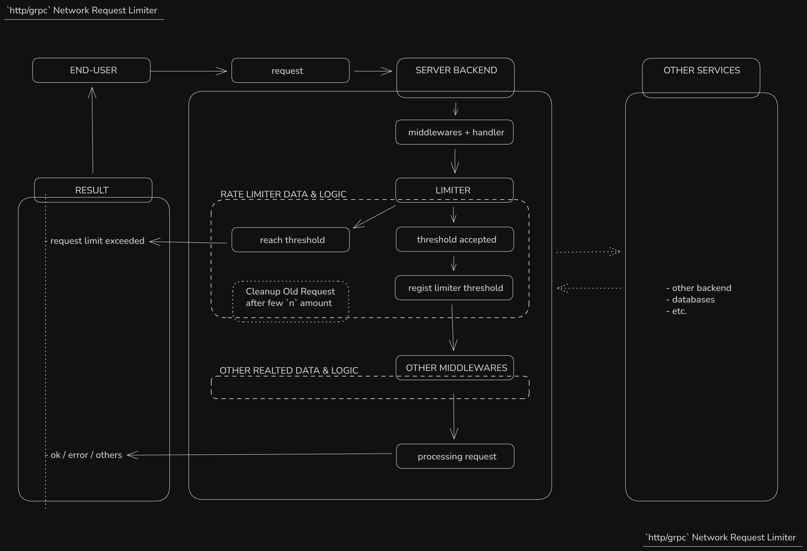
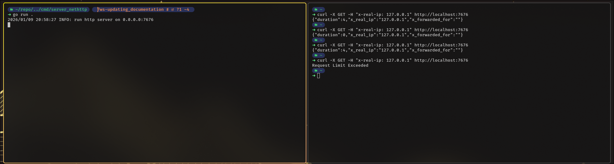
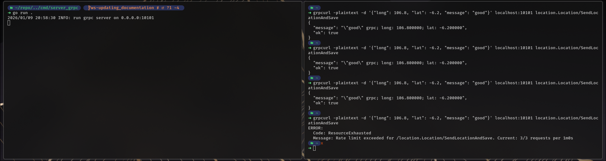

# network limiter go

<!--
thing/s to improve:
- tba
-->

a http & grpc server network request limiter in go

<br>

__*brief*__
```
there's/there'll be a time where you want to control network limit from an ip address,
yet sometime you doesn't want to or can't handle it from load balancer or from reverse proxy server

this project gave you example how to handle it when using http server or grpc server
```

<br>

__*goals*__
- create limiter for http/grpc server as brief explain based on ip address
- for http server, we're using standard library:
    <!-- *opinionated -->
    - less dependencies is good when to maintain and manage project become less hurdle
- in grpc server, we're using protobuf & grpc **from google*
- both http/grpc server configuration load from config file, so it's easily reconfigure
- create cleanup interval after the amount of `n` second when application running

<br>

---

## http/grpc limiter

- in most scenario, each request will has their own pre-condition:    
    - [http headers](https://developer.mozilla.org/en-US/docs/Web/HTTP/Reference/Headers)
    - [grpc metadata](https://grpc.io/docs/guides/metadata/)

- at first entry, we need to configure and load our config
```go
// for nethttp
cfg, err := config.ConfigServerHttpLoad("../../config.http.json")
// for grpc
cfg, err := config.ConfigServerGrpcLoad("../../config.grpc.json")
```

- read [net http config file](./config.http.json.template) or [grpc config file](./config.grpc.json.template)
    - you may need to copy config.http.json.template as config.http.json first for http
    - you also need to copy config.grpc.json.template as config.grpc.json first for grpc

- we also need to create limiter and assign it as middleware
```go
// for nethttp
limiter := http_limiter.NewHttpRateLimiter(
	uint(cfg.Limiter.MaxRequestPerIp), maxReqInterval)
middleware := &http_limiter.HttpMiddleware{Limiter: limiter}
// for grpc
limiter := grpc_limiter.NewGrpcRateLimiter(
	uint(cfg.Limiter.MaxRequestPerIp), maxReqInterval)
middleware := grpc_limiter.NewGrpcMiddleware(limiter)
```

- then we register our handler, *precondition for each handler depend on your implementation, in this example we use ip data from end-user

- later on, after a certain amount *depend on configuration:
    - we can run our cleanup from old request with goroutine
    ```go
    // for nethttp
	go http_limiter.CleanupOldRequest(limiter, cleanupInterval)
    // for grpc
	go grpc_limiter.CleanupOldRequest(limiter, cleanupInterval)
    ```

<br>

---

## flow

for display flow it looks like below `graph explanation`


<br>

---

## test

*unit test integration available* inside `test/unit_test` directory

you also can use `dtest.sh` script

<br>

---

### manual test

__*nethttp test:*__
1. run the nethttp server inside `cmd/server_nethttp`, go to that dir and run with `go run .`
2. use curl as below *or any tools you prefer
```sh
curl -X GET -H "x-real-ip: 127.0.0.1" http://localhost:7676
```
3. try couples of time, and you will see as the right side of image when limiter ip reach the threshold


<br>

__*grpc test*__
1. run the grpc server inside `cmd/server_grpc`, go to that dir and run with `go run .`
2. use grpcurl as below *or any tools you prefer
```sh
grpcurl -plaintext -d '{"long": 106.8, "lat": -6.2, "message": "good"}' localhost:10101 location.Location/SendLocationAndSave
```
3. try couples of time, and you also will see as the right side of image when limiter ip reach the threshold

4. if you want disable [reflection](./cmd/server_grpc/main.go#L79), you may use direct `-proto`, for security reason
```sh
grpcurl -proto protobuf/location.proto -plaintext -d '{"long": 106.8, "lat": -6.2, "message": "good"}' localhost:10101 location.Location/SendLocationAndSave
```

<br>

---

###### end of readme
